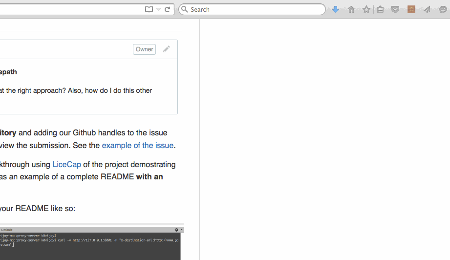

# proxy-server
first node js project

This is a Proxy Server for Node.js submitted as the [pre-work](http://courses.codepath.com/snippets/intro_to_nodejs/prework) requirement for CodePath.

Time spent: 8 hours

Completed:

* Requests to port `8000` are echoed back with the same HTTP headers and body
* Requests/reponses are proxied to/from the destination server
* The destination server is configurable via the `--host`, `--port`  or `--url` arguments
* The destination server is configurable via the `x-destination-url` header
* Client requests and respones are printed to stdout
* The `--logfile` argument outputs all logs to the file specified instead of stdout

Walkthrough Gif:
[Add walkthrough.gif to the project root]



Note: to embed the gif file, just check your gif file into your repo and update the name of the file above.

## Starting the Server

```bash
npm start
```

### Echo Server:

curl -v http://127.0.0.1:8000 -d "hello proxy"
* About to connect() to 127.0.0.1 port 8000 (#0)
*   Trying 127.0.0.1...
* Adding handle: conn: 0x7fa432803a00
* Adding handle: send: 0
* Adding handle: recv: 0
* Curl_addHandleToPipeline: length: 1
* - Conn 0 (0x7fa432803a00) send_pipe: 1, recv_pipe: 0
* Connected to 127.0.0.1 (127.0.0.1) port 8000 (#0)
> POST / HTTP/1.1
> User-Agent: curl/7.30.0
> Host: 127.0.0.1:8000
> Accept: */*
> Content-Length: 11
> Content-Type: application/x-www-form-urlencoded
> 
* upload completely sent off: 11 out of 11 bytes
< HTTP/1.1 200 OK
< user-agent: curl/7.30.0
< host: 127.0.0.1:8000
< accept: */*
< content-length: 11
< content-type: application/x-www-form-urlencoded
< Date: Thu, 20 Aug 2015 23:05:18 GMT
< Connection: keep-alive
< 
* Connection #0 to host 127.0.0.1 left intact
hello proxy

### Proxy Server:

Port 8001 will proxy to the echo server on port 8000.

curl -v http://127.0.0.1:8001 -d "hello proxy"
* About to connect() to 127.0.0.1 port 8001 (#0)
*   Trying 127.0.0.1...
* Adding handle: conn: 0x7ff670803a00
* Adding handle: send: 0
* Adding handle: recv: 0
* Curl_addHandleToPipeline: length: 1
* - Conn 0 (0x7ff670803a00) send_pipe: 1, recv_pipe: 0
* Connected to 127.0.0.1 (127.0.0.1) port 8001 (#0)
> POST / HTTP/1.1
> User-Agent: curl/7.30.0
> Host: 127.0.0.1:8001
> Accept: */*
> Content-Length: 11
> Content-Type: application/x-www-form-urlencoded
> 
* upload completely sent off: 11 out of 11 bytes
< HTTP/1.1 200 OK
< user-agent: curl/7.30.0
< host: 127.0.0.1:8001
< accept: */*
< content-length: 11
< content-type: application/x-www-form-urlencoded
< connection: close
< date: Thu, 20 Aug 2015 23:07:54 GMT
< 
* Closing connection 0
hello proxy


### Configuration:

#### CLI Arguments:

The following CLI arguments are supported:

##### `--host`

The host of the destination server. Defaults to `127.0.0.1`.

##### `--port`

The port of the destination server. Defaults to `80` or `8000` when a host is not specified.

##### `--url`

A single url that overrides the above. E.g., `http://www.google.com`

##### `--logfile`

Specify a file path to redirect logging to.

#### Headers

The follow http header(s) are supported:

##### `x-destination-url`

Specify the destination url on a per request basis. Overrides and follows the same format as the `--url` argument.